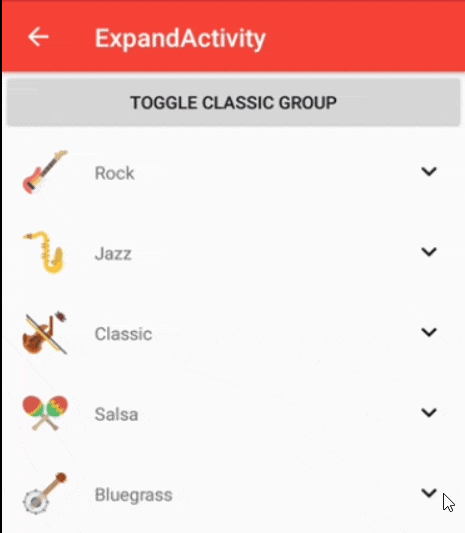

# Expandable RecyclerView
Custom RecyclerViewAdapters for expanding and collapsing groups with support for multiple view types



## How to use
1. Download the [ExpandableRecyclerView-(version).aar](https://github.com/monsterbrain/expandable-recycler-view/releases/latest) library file from releases.
2. Create a project / add the downloaded **aar file** into **app/libs** folder. (Use File->Sync with Project Files option to refresh)
 *(Make sure app/build.gradle file contains aar file dependency)*
  ```groovy
  implementation fileTree(dir: 'libs', include: ['*.jar', '*.aar'])
  implementation 'androidx.recyclerview:recyclerview:1.1.0'
  ```

Now you're ready to get started with a Sample Project. [Wiki Link](https://github.com/monsterbrain/expandable-recycler-view/wiki)

*Note: More details will be added to wiki soon* 

## Contributing

See the [CONTRIBUTING] document. Thank you, [contributors]!

## License

Expandable RecyclerView is Copyright (c) 2016 thoughtbot, inc. It is free software, and may be redistributed under the terms specified in the [LICENSE] file.

## About

Expandable RecyclerView is maintained by [@mandybess](https://github.com/mandybess)


Expandable RecyclerView is maintained and funded by thoughtbot, inc. The names and logos for thoughtbot are trademarks of thoughtbot, inc.

We love open source software! See [our other projects][tools] or [hire us][hire] to help build your product.

  [tools]: https://thoughtbot.com/tools?utm_source=github
  [hire]: https://thoughtbot.com/hire-us?utm_source=github
  [LICENSE]: /LICENSE
  [CONTRIBUTING]: CONTRIBUTING.md
  [contributors]: https://github.com/thoughtbot/expandable-recycler-view/graphs/contributors
